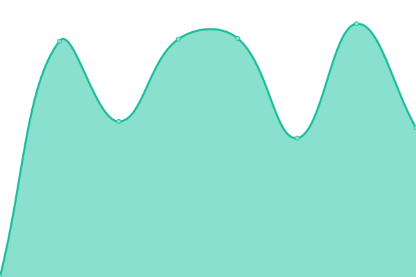
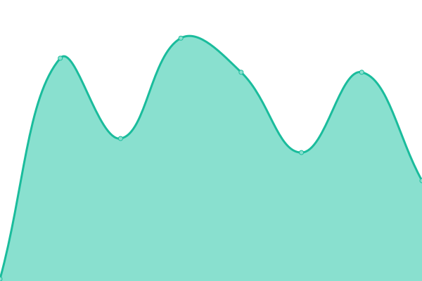

# [📈 Live Status](https://cxdy.github.io/monitoring): <!--live status--> **🟧 Partial outage**

This repository contains the open-source uptime monitor and status page for [Cody Kaczynski](codykaczynski.com), powered by [Upptime](https://github.com/upptime/upptime).

With [Upptime](https://upptime.js.org), you can get your own unlimited and free uptime monitor and status page, powered entirely by a GitHub repository. We use [Issues](https://github.com/cxdy/monitoring/issues) as incident reports, [Actions](https://github.com/cxdy/monitoring/actions) as uptime monitors, and [Pages](https://cxdy.github.io/monitoring) for the status page.

<!--start: status pages-->
<!-- This summary is generated by Upptime (https://github.com/upptime/upptime) -->
<!-- Do not edit this manually, your changes will be overwritten -->
<!-- prettier-ignore -->
| URL | Status | History | Response Time | Uptime |
| --- | ------ | ------- | ------------- | ------ |
|  [Stitched Sound](https://www.stitchedsound.com) | 🟥 Down | [stitched-sound.yml](https://github.com/cxdy/monitoring/commits/HEAD/history/stitched-sound.yml) | 

 106ms
     
 | 

<a href="https://monitor.stitchedsound.com/history/stitched-sound">0.00%</a>
    

|  [Stitched Sound Mail](https://mail.stitchedsound.com) | 🟥 Down | [stitched-sound-mail.yml](https://github.com/cxdy/monitoring/commits/HEAD/history/stitched-sound-mail.yml) | 

 71ms
     
 | 

<a href="https://monitor.stitchedsound.com/history/stitched-sound-mail">0.00%</a>
    

|  [Cody Kaczynski](https://codykaczynski.com) | 🟥 Down | [cody-kaczynski.yml](https://github.com/cxdy/monitoring/commits/HEAD/history/cody-kaczynski.yml) | 

 101ms
     
 | 

<a href="https://monitor.stitchedsound.com/history/cody-kaczynski">0.00%</a>
    

|  [Bar Pazzo Dev](https://barpazzo.namejeff.net) | 🟩 Up | [bar-pazzo-dev.yml](https://github.com/cxdy/monitoring/commits/HEAD/history/bar-pazzo-dev.yml) | 

 507ms
     
 | 

<a href="https://monitor.stitchedsound.com/history/bar-pazzo-dev">99.20%</a>
    

|  [Pazzo 315 Dev](https://pazzo315.namejeff.net) | 🟥 Down | [pazzo-315-dev.yml](https://github.com/cxdy/monitoring/commits/HEAD/history/pazzo-315-dev.yml) | 

 0ms
     
 | 

<a href="https://monitor.stitchedsound.com/history/pazzo-315-dev">0.00%</a>
    

<!--end: status pages-->

[**Visit our status website →**](https://cxdy.github.io/monitoring)

## 📄 License

- Powered by: [Upptime](https://github.com/upptime/upptime)
- Code: [MIT](./LICENSE) © [Cody Kaczynski](codykaczynski.com)
- Data in the `./history` directory: [Open Database License](https://opendatacommons.org/licenses/odbl/1-0/)
